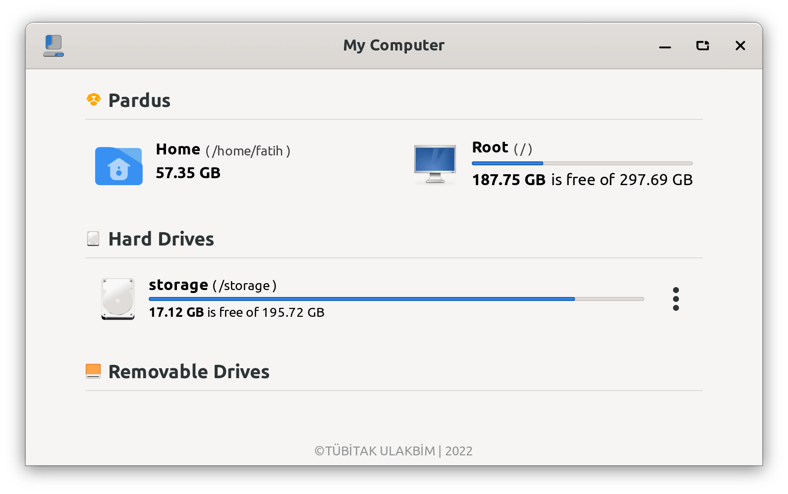
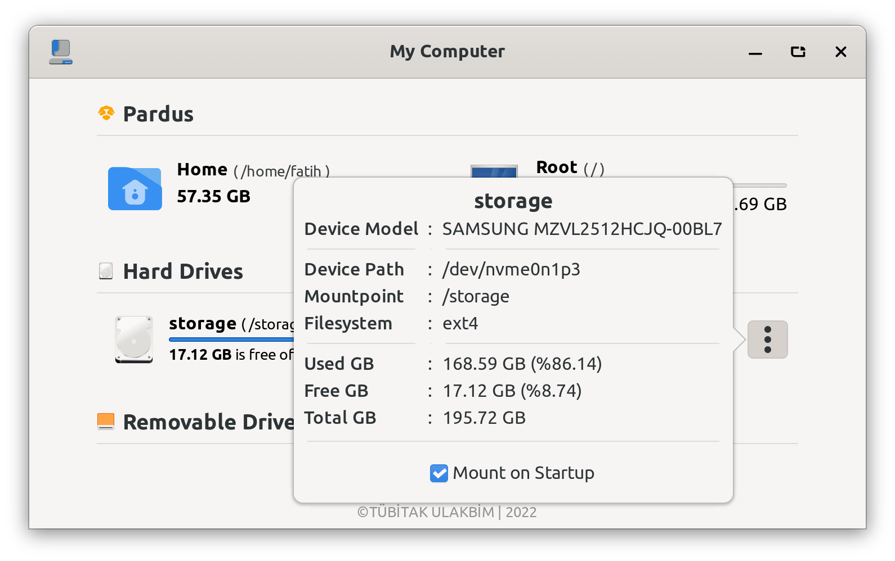
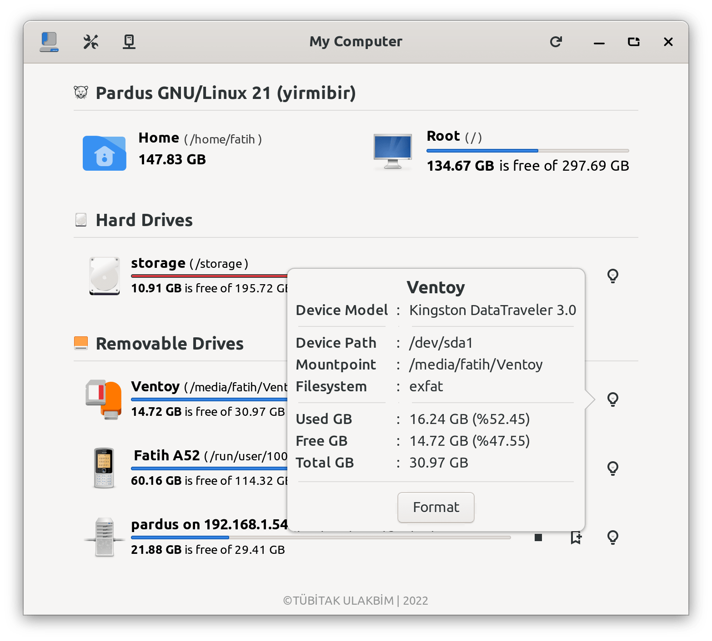
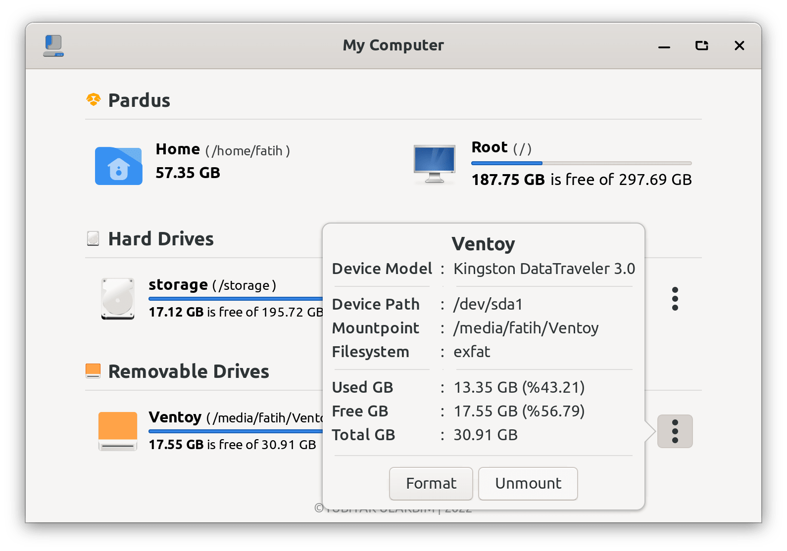

# Pardus My Computer

Pardus My Computer is an ui for information and management of disks on your computer.

It is currently a work in progress. Maintenance is done by <a href="https://www.pardus.org.tr/">Pardus</a> team.

## Dependencies:

* This application is developed based on Python3 and GTK+ 3. Dependencies:
   - ```gir1.2-glib-2.0 gir1.2-gtk-3.0 gir1.2-notify-0.7 python3-gi python3```

## Run Application from Source

* Install dependencies :
    * ```sudo apt install gir1.2-glib-2.0 gir1.2-gtk-3.0 gir1.2-notify-0.7 python3-gi python3```
* Clone the repository :
    * ```git clone https://github.com/pardus/pardus-mycomputer.git ~/pardus-mycomputer```
* Run application :
    * ```python3 ~/pardus-mycomputer/src/pardus-mycomputer```

## Build deb package

* `sudo apt install devscripts git-buildpackage`
* `sudo mk-build-deps -ir`
* `gbp buildpackage --git-export-dir=/tmp/build/pardus-mycomputer -us -uc`

## Screenshots








